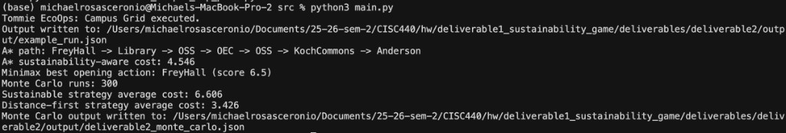
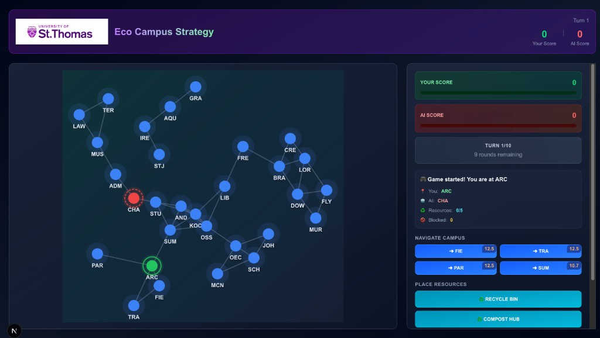

# Deliverable 1 Report — Tommie EcoOps: Campus Grid

**Course:** CISC 440 — Artificial Intelligence (Spring 2026)

---

## 1. Problem Design

- **Game/System Name:** Tommie EcoOps: Campus Grid
- **State definition(s):**
  - Search: `(current_node, remaining_required_visits)`
  - Minimax: control map over strategic nodes (`+1`, `-1`, `0`)
- **Action definition(s):**
  - Search: move to an adjacent campus node
  - Minimax: claim one neutral node
  - CSP: assign one resource value to each variable node
- **Goal / terminal conditions:**
  - Search goal: visit required sustainability nodes and end at target
  - Minimax terminal: depth limit reached or no neutral nodes remain

## 2. Graph Representation

- **Nodes:** named UST locations/buildings from campus map data
- **Edges:** valid movement paths with distances from `data/ust_building_edges.csv`
- **Connectivity:** distant buildings are reachable only through intermediate nodes (local adjacency)

## 3. Dataset Integration

| Dataset | Role in game |
|---|---|
| `ust_selected_game_nodes.csv` | Playable campus subset |
| `ust_building_edges.csv` | Graph edges and movement costs |
| `ust_distance_matrix.csv` | A* heuristic distances |
| `ust_energy_assets.csv` | Energy pressure penalties per building |
| `ust_campus_resources.csv` | Sustainability bonuses; CSP context |
| `ust_sustainability_factors.csv` | Trivia content and awareness gate values |
| `sustainability_words (2).txt` | Vocabulary gate for advanced actions |

## 4. AI Method Implementation

### A. Search and Minimax

| Component | Implementation |
|---|---|
| **Search** | A* with state `(current_node, remaining_required_visits)` |
| **Heuristic** | Matrix distance to nearest remaining task + distance to goal |
| **Movement cost** | `distance×1000 + energy_penalty − sustainability_bonus` |
| **Minimax** | Sustainability Planner (MAX) vs Demand Pressure Agent (MIN), depth 3 |
| **Evaluation** | Controlled-node sustainability bonuses minus energy penalties |
| **Pruning** | Alpha-beta in both max and min recursion |

**Sample run (deterministic):**

- Path: `FreyHall → Library → OSS → OEC → OSS → KochCommons → Anderson`
- Sustainability-aware cost: **4.546**
- Minimax best opening: **FreyHall** (score 6.5)

### B. CSP Component

| Item | Detail |
|---|---|
| **Variables** | Anderson, FreyHall, OEC, OSS, Schoenecker, Murray, Library, Brady |
| **Domain** | `NONE`, `RECYCLE_BIN`, `COMPOST_HUB`, `BIKE_SUPPORT` |
| **Constraints** | ≤5 non-NONE placements; all priority nodes served; ≥2 high-energy nodes served; ≤2 compost hubs |

**Example valid CSP solution** (from `example_run.json`):

| Building | Assignment |
|---|---|
| OEC | RECYCLE_BIN |
| Anderson | RECYCLE_BIN |
| FreyHall | RECYCLE_BIN |
| Schoenecker | RECYCLE_BIN |
| OSS, Murray, Library, Brady | NONE |

## 5. Integrated Sustainability Awareness

- Vocabulary attempt must match a valid sustainability term
- Sustainability factor trivia must be answered correctly
- Both must pass for the resource action to succeed
- **Pass:** extra bonuses on Anderson and FreyHall
- **Fail:** extra energy penalty on OSS
- Awareness directly changes search costs and minimax scoring (not a separate quiz)

## 6. Interactive Frontend (`tommie_eco/`)

In addition to the Python backend, the project includes a **playable Next.js web game** (`EcoCampusStrategyGame.tsx`) that runs the same AI ideas against live UST campus data.

### What the frontend does

| Feature | Description |
|---|---|
| **Real data loading** | On startup, fetches CSVs from `tommie_eco/public/` (nodes, edges, energy, resources, distance matrix, coordinates, vocabulary) |
| **Campus map UI** | SVG map of buildings; click adjacent nodes to move; player (green) vs AI (red) positions |
| **A\*** | `aStarTaskPlanner()` plans paths through high-value buildings during player movement |
| **Minimax** | `minimaxOpeningAction()` drives AI blocking decisions on strategic buildings |
| **CSP** | `solveResourceCSP()` validates resource placements (recycle, compost, bike support) |
| **Awareness / trivia** | Definition-based questions from `sustainability_words (2).txt` gate moves and resource actions |
| **Turn-based play** | 10-turn match: place resources, move on the graph, AI responds |
| **Results screen** | End-of-game summary with scores and logged algorithm calls (A\*, minimax, CSP) |

### How it connects to the Python backend

Both implementations share the same design:

- Same campus graph and datasets
- Same three AI methods (search, minimax, CSP)
- Same sustainability awareness concept (trivia affects what actions succeed)
- Python `src/main.py` produces batch JSON output for grading and Deliverable 2
- TypeScript `tommie_eco/src/lib/algorithms/` powers the interactive player experience

The frontend is the **player-facing game**; `main.py` is the **reproducible backend runner** for reports and Monte Carlo simulation.

### How to run the frontend

```bash
cd tommie_eco
npm install    # first time only
npm run dev
```

Open **http://localhost:3000**

**Key files:**

| File | Role |
|---|---|
| `tommie_eco/src/app/page.tsx` | App entry — loads the game component |
| `tommie_eco/src/components/EcoCampusStrategyGame.tsx` | Main game UI and orchestration |
| `tommie_eco/src/lib/algorithms/astar.ts` | A* path planning |
| `tommie_eco/src/lib/algorithms/minimax.ts` | Minimax opening / blocking |
| `tommie_eco/src/lib/algorithms/csp.ts` | Resource placement CSP |
| `tommie_eco/public/*.csv` | UST datasets served to the browser |

## 7. Python Backend Implementation (`src/main.py`)

| Module | Functions |
|---|---|
| Data / graph | `load_csv`, `build_graph`, `load_distance_matrix` |
| Scoring | `energy_penalty_by_graph_node`, `sustainability_bonus_by_graph_node` |
| Search | `SearchState`, `movement_cost`, `a_star_task_planner` |
| Minimax | `minimax_opening_action` |
| CSP | `solve_resource_csp` |
| Awareness | `awareness_gate` |

**Execution flow in `main()`:**

1. Load datasets from `data/`
2. Build graph and distance lookup
3. Compute energy penalties and sustainability bonuses
4. Run awareness gate and apply modifiers
5. Run A*, minimax, and CSP
6. Write `../deliverable2/output/example_run.json`

## 8. Code and Execution

**Python backend (JSON output for reports / D2):**

```bash
python3 src/main.py
```

Writes `deliverables/deliverable2/output/example_run.json`

**Interactive frontend (playable game):**

```bash
cd tommie_eco && npm run dev
```

## 9. Explanation and Reflection

**Design decisions:** We built **one integrated system** (Eco Campus Strategy Game) instead of two separate games. Search handles movement, minimax models competition, and CSP handles resource placement — all on the same UST campus graph.

**How AI methods are used:**

- **A\*** explores `(current_node, remaining_tasks)` with a sustainability-weighted cost function.
- **Minimax** chooses strategic opening moves for planner vs pressure agent.
- **CSP backtracking** assigns limited campus resources under coverage rules.

**How datasets are used:** Energy assets raise cost in high-load buildings; campus resources add bonuses; distance matrix powers heuristics; sustainability factors and vocabulary gate action success.

**Shortest vs sustainable route trade-off:** A* cost **4.546** is not pure distance — it balances LEED/green bonuses and energy penalties. A distance-only plan would skip sustainability signals and may miss mission value even if travel is shorter.

## 10. Screenshots and Example Output

### Python backend run (`python3 src/main.py`)



**Results shown:**

- A* path: `FreyHall → Library → OSS → OEC → OSS → KochCommons → Anderson`
- Sustainability-aware cost: **4.546**
- Minimax best opening: **FreyHall** (score **6.5**)
- Monte Carlo (300 runs): sustainable avg **6.606**, distance-first avg **3.426**
- Output files: `deliverables/deliverable2/output/example_run.json`, `deliverable2_monte_carlo.json`

### Web frontend (`npm run dev` → http://localhost:3000)



**What the screenshot shows:**

- UST logo and **Eco Campus Strategy** UI
- Campus graph with player (green, ARC) and AI (red, CHA) positions
- Turn-based controls: navigate adjacent buildings, place **RECYCLE BIN** / **COMPOST HUB**
- Live scores and game log tied to real CSV campus data

Structured JSON evidence: `deliverables/deliverable2/output/example_run.json`

**Improvements:** Sync Python/TypeScript constants; make awareness fully interactive in both UIs (Python currently simulates some answers).

## 11. Checklist

- [x] Uses real dataset values
- [x] Includes search (A*) and minimax
- [x] Includes CSP component
- [x] Components interact in one `main()` pipeline
- [x] Sustainability awareness affects gameplay decisions
- [x] Interactive frontend implements the same AI methods with real UST data
- [x] Screenshots included (console + web UI)
